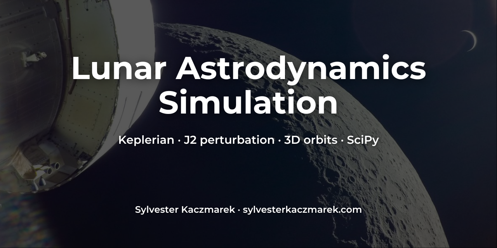

# Lunar Astrodynamics Simulation
[](https://www.python.org/downloads/)
[](https://opensource.org/licenses/MIT)



Python simulation of lunar orbital mechanics. Models spacecraft dynamics under the Moon's non-uniform gravity field (J2, mascons) using numerical integration (SciPy). Astrodynamics example.

## Overview

This repository contains code to simulate the orbit of a satellite around the Moon, demonstrating the effect of gravitational perturbations beyond the simple two-body problem. It serves as an exploration into computational astrodynamics, focusing on the unique challenges presented by the Moon's complex gravity field.

The simulation starts with the basic 2-body problem (Keplerian orbit) and then introduces the J2 perturbation (due to the Moon's oblateness) as a first-order correction. Explanations and code structure are provided to facilitate understanding and potential expansion to include higher-order terms like mascons.

**Coordinate System.** Moon-Centered Inertial (MCI) frame. Origin at the Moon's center. Axes fixed relative to distant stars.

## Background & Physics

The motion of a satellite is governed by the gravitational forces acting upon it.

### 1. Two-Body Problem (Central Body Gravity)

In the simplest model, only the Moon's gravity, treated as a point mass, is considered. The acceleration is inversely proportional to the square of the distance and directed towards the Moon's center. This results in a predictable Keplerian orbit (ellipse, parabola, hyperbola). The governing equations are detailed in the accompanying Jupyter Notebook.

### 2. J2 Perturbation (Oblateness)

The Moon is not perfectly spherical; it bulges slightly at the equator. The J2 coefficient quantifies the dominant part of this oblateness. This asymmetry adds a perturbing acceleration component, which primarily causes:
*   **Nodal Precession.** Rotation of the orbital plane around the Moon's polar axis.
*   **Apsidal Precession.** Rotation of the orbit's orientation within its plane.
The specific equations for the J2 acceleration depend on the J2 coefficient, the Moon's gravitational parameter and radius, and the satellite's position, as shown in the notebook.

### 3. Mascons & Higher-Order Terms (Not Implemented Here)

The Moon's gravity field is highly irregular due to **mascons** (mass concentrations) beneath the surface, remnants of large impacts. Accurately modeling these requires representing the gravitational potential using spherical harmonics. The perturbing acceleration is derived from the gradient of this potential. Implementing this involves complex calculations with Legendre polynomials and handling many coefficients from gravity models (e.g., GRGM1200A, GLGM-3), further detailed in the notebook's explanations.

## Features

*   Simulates satellite orbits around the Moon using numerical integration (`scipy.integrate.solve_ivp`).
*   Models the central body (Keplerian) gravitational force.
*   Includes the J2 gravitational perturbation effect.
*   Visualizes the comparison between Keplerian and J2-perturbed orbits in 3D.
*   Provides a framework and explanation for incorporating more complex gravity models (mascons).

## Installation

Ensure you have Python 3 installed. The required libraries can be installed using pip:

```bash
pip install numpy scipy matplotlib
```

The script will execute the simulation and should generate a plot similar to the one shown below.

## Example Output / Visualization
The simulation output includes a 3D plot comparing the ideal Keplerian orbit with the J2-perturbed orbit over several revolutions.


Observe the slight deviations caused by the J2 effect, primarily manifesting as precession of the orbital plane.

## Limitations

*   **Gravity Model.** Only includes the J2 perturbation. Higher-order terms (mascons) are not implemented.
*   **Other Perturbations.** Does not account for third-body gravity (Earth, Sun), solar radiation pressure, atmospheric drag (negligible for Moon), or relativistic effects.
*   **Coordinate System.** Uses a simplified MCI frame; does not account for frame precession/nutation.

## Future Work

*   Implement higher-order spherical harmonic terms (Cnm, Snm) from a standard lunar gravity model (e.g., GRGM1200A) to accurately simulate mascon effects.
*   Add third-body gravitational perturbations from the Earth and Sun.
*   Incorporate solar radiation pressure models.
*   Visualize the time evolution of classical orbital elements (a, e, i, Ω, ω, M) to better quantify perturbation effects.
*   Compare simulation results against known data or established software (e.g., GMAT, Orekit).

## License

MIT. See [LICENSE](LICENSE).

© **Sylvester Kaczmarek** · https://www.sylvesterkaczmarek.com
