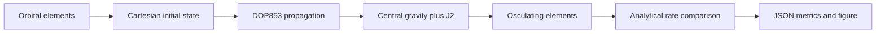
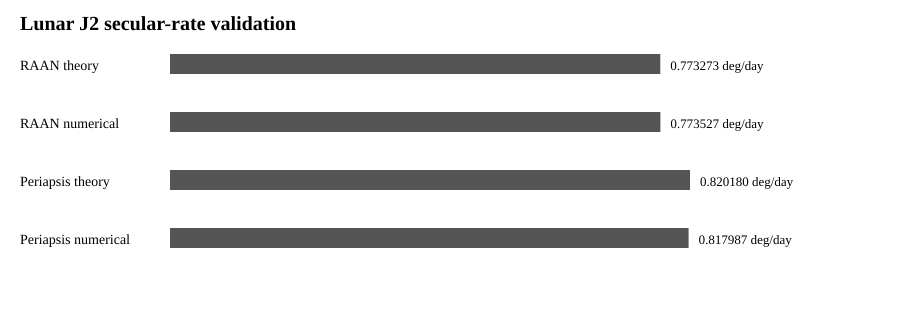

# Lunar Astrodynamics Simulation


[](https://github.com/sylvesterkaczmarek/lunar-astrodynamics-simulation/actions/workflows/ci.yml)


Validated Python demonstration of low lunar orbit propagation with central gravity and the Moon's J2 perturbation. The repository uses a non-singular inclined, mildly eccentric orbit so that nodal and apsidal precession are observable and can be checked against first-order analytical J2 theory.

## At a glance


```mermaid
flowchart LR
    A[Orbital elements] --> B[Cartesian initial state]
    B --> C[DOP853 propagation]
    C --> D[Central gravity plus J2]
    D --> E[Osculating elements]
    E --> F[Analytical rate comparison]
    F --> G[JSON metrics and figure]
```

The central validation question is simple: does the integrated J2 model reproduce the expected secular rates of right ascension of the ascending node and argument of periapsis while preserving the invariants that an axisymmetric field should preserve?



## What changed from the original notebook

- Corrected the lunar GM and separated gravity-model reference radius from physical mean radius.
- Replaced the exactly equatorial circular example with an inclined, eccentric orbit where RAAN and periapsis are defined.
- Added Cartesian and classical-element conversions.
- Added analytical first-order J2 secular-rate calculations.
- Switched the reference propagator to SciPy `DOP853` with separate position and velocity absolute tolerances.
- Added terminal mean-radius surface-impact detection.
- Added quantitative regression tests rather than treating solver completion as physics validation.
- Documented why full GRAIL harmonics require a lunar body-fixed principal-axes frame.
- Added packaging, CI, reproducibility documentation, machine-readable results, and citation metadata.

## Quick start

```bash
git clone https://github.com/sylvesterkaczmarek/lunar-astrodynamics-simulation.git
cd lunar-astrodynamics-simulation
python -m venv .venv
source .venv/bin/activate
python -m pip install -e .[dev]
python -m pytest
python examples/j2_precession.py --orbits 40
```

Windows PowerShell users can activate the environment with `.vent\Scripts\Activate.ps1`.

## Model

The implemented acceleration is central lunar gravity plus the axisymmetric J2 perturbation. The low-degree demonstration uses the GRGM1200A reference radius and GM, with a rounded GRGM1200A J2 value. The impact boundary uses the JPL mean lunar radius.

See [docs/model.md](docs/model.md) for equations, parameter provenance, frame assumptions, and exclusions.

## Validation

The automated tests cover:

- two-body specific-energy conservation
- two-body angular-momentum conservation
- axial angular-momentum conservation under J2
- numerical versus analytical J2 nodal precession
- numerical versus analytical J2 apsidal precession
- singular orbital-element handling
- terminal surface-impact detection
- invalid below-surface initial states
- default integration convergence against a tighter numerical reference

The full example stores the measured rates and relative errors in [`results/j2_validation.json`](results/j2_validation.json).

## Results snapshot

The checked-in 40-orbit regression run gives:

| Quantity | Analytical | Numerical | Relative difference |
|---|---:|---:|---:|
| RAAN rate | -0.773273 deg/day | -0.773527 deg/day | 0.033% |
| Periapsis-argument rate | 0.820180 deg/day | 0.817987 deg/day | 0.267% |

The same run preserves axial angular momentum with a relative span of about `4.0e-12`. After five orbits, the default integrator differs from a tighter numerical reference by about `4.5e-05 m` in position. The validation orbit does not intersect the mean-radius lunar surface. These are low-degree J2 validation results, not mission-grade orbit-prediction accuracy claims.

## Repository layout

```text
lunar-astrodynamics-simulation/
├── .github/workflows/ci.yml
├── assets/
│   ├── results/j2_precession.svg
│   └── social/github-social-card-lunar-astrodynamics.png
├── docs/
│   ├── model.md
│   └── reproducibility.md
├── examples/j2_precession.py
├── lunar_orbit_simulation.ipynb
├── results/j2_validation.json
├── src/lunar_astrodynamics/
│   ├── analysis.py
│   ├── constants.py
│   ├── dynamics.py
│   ├── elements.py
│   └── propagation.py
├── tests/
├── CITATION.cff
├── LICENSE
├── Makefile
├── pyproject.toml
├── requirements.txt
└── README.md
```

## What this repository does not claim

This is a validated low-degree demonstration, not a mission-grade lunar force model. It does not yet implement GRGM1200A or GL1800F spherical harmonics, lunar libration, third-body gravity, solar radiation pressure, terrain-aware collision detection, or flight-dynamics covariance propagation.

Calling the current model a mascon simulation would be inaccurate. Higher-order GRAIL gravity is future work and requires body-fixed frame handling before the coefficients can be used correctly.

## Extending

The next scientifically meaningful extension is a body-fixed spherical-harmonic evaluator using an archived GRAIL model, with explicit normalization handling, epoch-dependent lunar orientation, and cross-validation against established astrodynamics software.

## Reproducibility

See [docs/reproducibility.md](docs/reproducibility.md).

## Cite this repository

If you use or adapt this repository, please cite:

> Kaczmarek, S. (2026). *Lunar Astrodynamics Simulation*. GitHub. https://github.com/sylvesterkaczmarek/lunar-astrodynamics-simulation

```bibtex
@software{Kaczmarek_2026_Lunar_Astrodynamics_Simulation,
  author = {Sylvester Kaczmarek},
  title  = {Lunar Astrodynamics Simulation},
  year   = {2026},
  url    = {https://github.com/sylvesterkaczmarek/lunar-astrodynamics-simulation}
}
```

## License

MIT. See [LICENSE](LICENSE).

© **Sylvester Kaczmarek** · [https://www.sylvesterkaczmarek.com](https://www.sylvesterkaczmarek.com)
