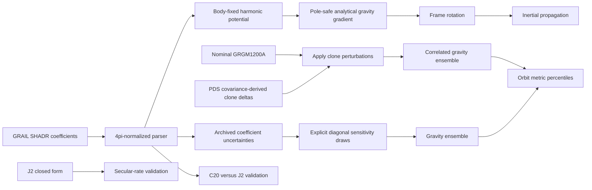

# Lunar Astrodynamics Simulation


[](https://github.com/sylvesterkaczmarek/lunar-astrodynamics-simulation/actions/workflows/ci.yml)


Validated Python simulation of lunar orbital dynamics from central gravity and J2 through high-degree GRAIL spherical harmonics. The code reads NASA PDS SHADR gravity products, evaluates fully normalized `Cnm/Snm` fields in the lunar body-fixed frame with a pole-safe analytical Cartesian gradient, preserves archived gravity-coefficient uncertainty metadata, and supports trajectory ensembles across alternative gravity realizations.

## At a glance


```mermaid
flowchart LR
    A[GRAIL SHADR coefficients] --> B[4pi-normalized parser]
    B --> C[Body-fixed harmonic potential]
    C --> D[Pole-safe analytical gravity gradient]
    D --> E[Frame rotation]
    E --> F[Inertial propagation]
    B --> U[Archived coefficient uncertainties]
    U --> V[Explicit diagonal sensitivity draws]
    N[Nominal GRGM1200A] --> W[Apply clone perturbations]
    K[PDS covariance-derived clone deltas] --> W
    W --> X[Correlated gravity ensemble]
    V --> Y[Gravity ensemble]
    X --> Z[Orbit metric percentiles]
    Y --> Z
    G[J2 closed form] --> H[Secular-rate validation]
    B --> I[C20 versus J2 validation]
```

The low-degree J2 benchmark provides an independent analytical check on the numerical machinery. The spherical-harmonic layer adds longitude-dependent tesseral and sectoral terms, including the gravity signatures associated with lunar mascons. Gravity-field uncertainty is handled as an ensemble problem. Covariance-derived PDS clone **perturbations** are added to the nominal GRGM1200A coefficients, while independent-sigma sampling remains a separately named, explicitly acknowledged approximation.

## Implemented models

- central lunar gravity
- closed-form J2 perturbation
- geodesy 4pi-normalized spherical harmonics
- arbitrary `Cnm/Snm` degree and order truncation
- NASA PDS SHADR parsing using the published fixed-column record layout
- preservation of SHADR `C`/`S` coefficient uncertainty fields and GM uncertainty
- GRGM1200A metadata and download tooling
- official GRGM1200A clone URL mapping and selected-file download tooling
- clone files represented as coefficient perturbations rather than standalone gravity models
- application of clone perturbations to a compatible nominal GRGM1200A model
- explicit reproducible diagonal coefficient perturbation for sensitivity studies
- trajectory ensemble propagation across complete gravity realizations
- percentile summaries for altitude, osculating apsides, eccentricity, lifetime, and impact fraction
- pole-safe body-fixed harmonic acceleration, including exact rotation-axis evaluation
- body-fixed to inertial force transformation
- optional SPICE frame transformations
- terminal mean-radius surface event

The evaluator is stress-tested through degree 1200, including equatorial, mid-latitude, near-pole, and exact north/south-axis evaluations. The longitudinal gravity term is evaluated with a direct recurrence for `Pbar_nm / cos(phi)` rather than dividing by `cos(phi)` or displacing a pole evaluation to an artificial nearby point. The SHADR reader is regression-tested with byte-faithful 244-byte header and 122-byte coefficient records matching the PDS specification, including retention of coefficient uncertainties. The nominal GRGM1200A table and the external covariance/clone products remain NASA data products and are not copied into this repository.

## Validation

The current automated suite contains **76 tests**. The gravity-specific validation includes:

- normalized `C20` acceleration versus an independent closed-form J2 implementation;
- analytical Cartesian acceleration versus an independent Cartesian finite-difference gradient of the potential;
- zonal, tesseral, and sectoral synthetic fields;
- equatorial, mid-latitude, low-altitude, and higher-altitude locations;
- very near both poles and exactly on both rotation-axis poles;
- convergence to the same Cartesian pole field from multiple approach azimuths;
- continuity while crossing a pole despite the longitude coordinate jump;
- degree/order truncation equivalence;
- finite normalized-function and acceleration evaluation through degree/order 1200;
- body-fixed/inertial rotation consistency, including an exact-pole case;
- SHADR coefficient and GM uncertainty retention;
- uncertainty-array validation and truncation;
- seeded reproducibility of diagonal sensitivity draws;
- mandatory explicit opt-in before independent coefficient sampling;
- GRGM1200A clone archive URL grouping;
- coefficient-only clone perturbation parsing and rejection of incomplete clone files;
- application of clone deltas to a compatible nominal field;
- loading multiple external clone perturbations into complete gravity realizations;
- ensemble percentile and impact-fraction calculations;
- end-to-end propagation of one initial orbit through multiple gravity realizations.

Two retained numerical checks are:

| Check | Result |
|---|---:|
| Normalized `C20` acceleration versus closed-form J2 | `1.83e-16` relative difference |
| Tesseral analytical acceleration versus finite-difference potential gradient | `9.86e-10` relative difference |

The original 40-orbit J2 regression remains unchanged:

| Quantity | Analytical | Numerical | Relative difference |
|---|---:|---:|---:|
| RAAN rate | -0.773273 deg/day | -0.773527 deg/day | 0.033% |
| Periapsis-argument rate | 0.820180 deg/day | 0.817987 deg/day | 0.267% |

See [`results/j2_validation.json`](results/j2_validation.json), [`results/harmonic_validation.json`](results/harmonic_validation.json), [`docs/model.md`](docs/model.md), and [`docs/uncertainty.md`](docs/uncertainty.md).

## Quick start

```bash
git clone https://github.com/sylvesterkaczmarek/lunar-astrodynamics-simulation.git
cd lunar-astrodynamics-simulation
python -m venv .venv
source .venv/bin/activate
python -m pip install -e .[dev]
python -m pytest
python examples/j2_precession.py --orbits 40
python examples/harmonic_validation.py
python examples/gravity_uncertainty.py --samples 16 --seed 20260817 --duration-days 1
```

Windows PowerShell users can activate the environment with `.venv\Scripts\Activate.ps1`.

## Use GRGM1200A

Download the official NASA PDS nominal product:

```bash
python scripts/download_grgm1200a.py
```

Then evaluate the full degree/order 1200 field at a body-fixed point:

```bash
python examples/grgm1200a_gravity.py \
  --model data/gggrx_1200a_sha.tab \
  --degree 1200 \
  --position-km 1900 200 300
```

The archived GRGM1200A metadata used by the code are GM `4902.80011526323 km^3/s^2`, reference radius `1738.0 km`, geodesy 4pi normalization, and a DE430-defined lunar principal-axes body-fixed frame.

## Gravity-field uncertainty

`read_shadr(...)` retains the uncertainty fields distributed with a SHADR gravity product:

```python
from lunar_astrodynamics import GRGM1200A, read_shadr

model = read_shadr(
    "data/gggrx_1200a_sha.tab",
    max_degree=120,
    frame=GRGM1200A.body_fixed_frame,
)
sigma_c20, sigma_s20 = model.coefficient_uncertainty(2, 0)
```

Those coefficient uncertainties do not contain cross-covariances. The library therefore refuses independent coefficient perturbation unless the approximation is acknowledged explicitly:

```python
from lunar_astrodynamics import sample_independent_coefficient_uncertainty

realizations = sample_independent_coefficient_uncertainty(
    model,
    seed=1234,
    count=100,
    assume_independent=True,
)
```

For correlated GRGM1200A gravity uncertainty, use the covariance-derived clone perturbations archived by NASA PDS. Download only the files required for the study:

```bash
python scripts/download_grgm1200a_clones.py 1 2 3 4 5
```

Clone coefficients are deviations from the nominal GRGM1200A solution. They must be added to the nominal coefficients before propagation. The library enforces that distinction:

```python
from pathlib import Path
from lunar_astrodynamics import (
    GRGM1200A,
    load_grgm1200a_clone_ensemble,
    propagate_gravity_ensemble,
    read_shadr,
)

nominal = read_shadr(
    "data/gggrx_1200a_sha.tab",
    max_degree=120,
    frame=GRGM1200A.body_fixed_frame,
)
paths = sorted(Path("data/grgm1200a_clones").glob("*_sha.tab"))
models = load_grgm1200a_clone_ensemble(
    nominal,
    paths,
    max_degree=120,
)

result = propagate_gravity_ensemble(
    initial_state,
    duration_s,
    models,
    rotation,
    max_degree=120,
)

print(result.percentiles["minimum_altitude_m"])
print(result.impact_fraction)
```

The default summary reports 5th, 50th, and 95th percentiles. See [`docs/uncertainty.md`](docs/uncertainty.md) for the statistical interpretation and limitations.

The end-to-end example can use either the self-contained diagonal demonstration or external correlated clone perturbations:

```bash
python examples/gravity_uncertainty.py \
  --nominal data/gggrx_1200a_sha.tab \
  --degree 120 \
  --duration-days 1 \
  --clones data/grgm1200a_clones/gggrx_1200a_clone0001_sha.tab \
           data/grgm1200a_clones/gggrx_1200a_clone0002_sha.tab
```

## High-degree timing

A timing harness is provided for measuring acceleration synthesis without turning variable shared-runner timings into a CI pass/fail criterion:

```bash
python scripts/benchmark_harmonics.py --degree 1200 --repetitions 5
```

It can also benchmark an externally downloaded SHADR model with `--model`.

## Inertial propagation

High-degree lunar gravity must not be frozen in an inertial frame. Supply an explicit body-fixed-from-inertial rotation:

```python
from lunar_astrodynamics import (
    gravity_acceleration_inertial,
    propagate_with_acceleration,
    spice_rotation_provider,
)

rotation = spice_rotation_provider(
    "J2000",
    "YOUR_LOADED_LUNAR_PA_FRAME",
    et_offset_s=et0,
)

acceleration = lambda t, r: gravity_acceleration_inertial(
    t,
    r,
    model,
    rotation,
    max_degree=1200,
)

solution = propagate_with_acceleration(
    initial_state,
    duration_s,
    acceleration,
    collision_radius_m=1_737_400.0,
)
```

The frame name is intentionally not hard-coded. It must correspond to the SPICE kernel set loaded by the user.

## Mascons

The implementation does not approximate mascons as separate point masses. Their gravity signatures are represented by the high-degree GRAIL spherical-harmonic coefficients. This is why `mascons` and `spherical-harmonics` are accurate repository topics once an actual GRAIL coefficient set is used.

## Repository layout

```text
lunar-astrodynamics-simulation/
├── .github/workflows/ci.yml
├── assets/
│   ├── results/j2_precession.svg
│   └── social/github-social-card-lunar-astrodynamics.png
├── docs/
│   ├── model.md
│   ├── reproducibility.md
│   └── uncertainty.md
├── examples/
│   ├── gravity_uncertainty.py
│   ├── grgm1200a_gravity.py
│   ├── harmonic_validation.py
│   └── j2_precession.py
├── scripts/
│   ├── benchmark_harmonics.py
│   ├── download_grgm1200a.py
│   └── download_grgm1200a_clones.py
├── src/lunar_astrodynamics/
│   ├── analysis.py
│   ├── constants.py
│   ├── dynamics.py
│   ├── elements.py
│   ├── frames.py
│   ├── harmonics.py
│   ├── propagation.py
│   └── uncertainty.py
├── tests/
├── CITATION.cff
├── LICENSE
├── Makefile
├── pyproject.toml
└── README.md
```

## What this repository does not claim

This remains a research and validation implementation, not certified flight-dynamics software. Degree/order 1200 is the current tested high-degree target; the direct normalized recursion is not presented as an arbitrary ultra-high-degree extended-range/Clenshaw implementation. The package can propagate empirical ensembles built from supplied covariance-derived GRGM1200A clone perturbations and can perform an explicitly diagonal coefficient-sigma approximation, but it does not construct or propagate the complete GRGM1200A covariance matrix internally. Gravity uncertainty here also does not include spacecraft state uncertainty, terrain uncertainty, third-body model uncertainty, solar radiation pressure uncertainty, or orbit-determination uncertainty.

The repository does not bundle NASA's large gravity or clone datasets, lunar topography, automatic SPICE kernels, third-body gravity, solar radiation pressure, state covariance propagation, or orbit-determination estimation.

See [docs/model.md](docs/model.md) for the force model, [docs/uncertainty.md](docs/uncertainty.md) for gravity-field uncertainty, and [docs/reproducibility.md](docs/reproducibility.md) for exact checks.

## Cite this repository

If you use or adapt this repository, please cite:

> Kaczmarek, S. (2026). *Lunar Astrodynamics Simulation*. GitHub. https://github.com/sylvesterkaczmarek/lunar-astrodynamics-simulation

```bibtex
@software{Kaczmarek_2026_Lunar_Astrodynamics_Simulation,
  author = {Sylvester Kaczmarek},
  title  = {Lunar Astrodynamics Simulation},
  year   = {2026},
  url    = {https://github.com/sylvesterkaczmarek/lunar-astrodynamics-simulation}
}
```

## License

MIT. See [LICENSE](LICENSE).

© **Sylvester Kaczmarek** · [https://www.sylvesterkaczmarek.com](https://www.sylvesterkaczmarek.com)
