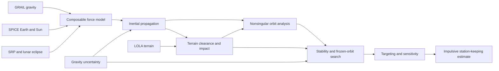

# Lunar Astrodynamics Simulation


[](https://github.com/sylvesterkaczmarek/lunar-astrodynamics-simulation/actions/workflows/ci.yml)


Validated Python lunar-orbit simulation and preliminary mission-analysis tooling from central gravity and J2 through high-degree GRAIL spherical harmonics, gravity-field uncertainty ensembles, LOLA terrain clearance, ephemeris-driven Earth/Sun perturbations, optional solar radiation pressure with lunar eclipse handling, nonsingular orbital analysis, automated low-lunar-orbit stability/frozen-orbit search, local targeting and preliminary impulsive station-keeping analysis.

The code keeps gravity, terrain, ephemerides, frames, uncertainty, perturbation forces, orbital-analysis conventions, search definitions, numerical sensitivity settings, correction diagnostics and control thresholds explicit. Large NASA/NAIF datasets remain external and simulation provenance is exposed rather than hidden behind automatic model choices.

## At a glance


```mermaid
flowchart LR
    G[GRAIL gravity] --> F[Composable force model]
    E[SPICE Earth and Sun] --> F
    S[SRP and lunar eclipse] --> F
    F --> P[Inertial propagation]
    U[Gravity uncertainty] --> P
    P --> A[Nonsingular orbit analysis]
    L[LOLA terrain] --> C[Terrain clearance and impact]
    P --> C
    C --> A
    A --> Q[Stability and frozen-orbit search]
    U --> Q
    C --> Q
    Q --> T[Targeting and sensitivity]
    T --> K[Impulsive station-keeping estimate]
```

## Implemented capabilities

- central lunar gravity and closed-form J2 perturbation
- geodesy 4pi-normalized spherical harmonics with arbitrary degree/order truncation
- NASA PDS SHADR parsing with retained coefficient and GM uncertainty fields
- pole-safe high-degree GRAIL gravity evaluation through degree/order 1200
- explicit body-fixed to inertial transformations and optional SPICE support
- covariance-derived GRGM1200A clone perturbation ensembles
- reproducible diagonal coefficient-sigma sensitivity sampling with explicit opt-in
- orbit uncertainty percentiles for altitude, osculating apsides, eccentricity, lifetime and impact
- NASA Goddard LOLA `MOON_PA_DE421` and standard LOLA PDS global terrain loading
- terrain-aware clearance, minimum-clearance geometry and impact events
- explicitly named mean-radius spherical collision fallback
- composable named force components with per-component acceleration diagnostics
- Moon-centred differential Earth and Sun third-body gravity
- deterministic SPICE epoch handling with kernel/frame/epoch provenance
- optional cannonball solar-radiation pressure using configurable mass, area and reflectivity coefficient
- finite apparent Sun/Moon disk eclipse model with full sunlight, umbra, annular and partial-shadow behaviour
- physical orbital vectors including eccentricity vector, angular momentum and orbital-plane normal
- prograde modified equinoctial elements with direct Cartesian conversions
- nonsingular trajectory histories for osculating apsides, eccentricity-vector, plane and apsidal evolution
- secular-drift and detrended bounded-oscillation statistics for frozen-orbit studies
- automated coarse and coarse-to-fine lunar stability/frozen-orbit search
- transparent per-candidate periselene, aposelene, eccentricity-vector, eccentricity, plane, apsidal, lifetime and clearance metrics
- configurable hard stability constraints separated from a fully decomposed ranking penalty
- physical-state deduplication of singular classical search combinations using modified equinoctial elements
- deterministic parallel candidate evaluation for explicitly parallel-safe force models
- uncertainty-aware candidate evaluation through supplied gravity realizations
- terrain-clearance constraints when an explicit LOLA-derived terrain model is supplied
- structured JSON/CSV search output and auditable 2-D stability-map generation
- central finite-difference Jacobians with half/base/double step-size consistency diagnostics
- numerical Cartesian state-transition matrices for arbitrary composable force models
- propagated initial-orbit-parameter sensitivity for apsides, eccentricity-vector drift, altitude and terrain clearance
- scaled damped least-squares differential correction with line search, rank/conditioning checks and explicit non-convergence results
- local targeting of periselene, aposelene, eccentricity-vector drift, sampled periapsis location and terrain clearance
- threshold-triggered impulsive station-keeping estimates with per-manoeuvre and total delta-v accounting
- external gravity, terrain and SPICE download/validation tooling

## Validation

The automated suite contains **144 tests** and passes on Python 3.10, 3.12 and 3.13.

Gravity validation includes normalized `C20` versus an independent J2 implementation, Cartesian finite-difference gradients, zonal/tesseral/sectoral fields, equatorial and polar cases, pole-crossing continuity, degree/order truncation, degree-1200 finiteness, and body-fixed/inertial consistency.

Uncertainty validation covers SHADR uncertainty retention, seeded reproducibility, explicit independent-sampling opt-in, covariance-derived clone perturbation semantics, percentile calculations and end-to-end gravity ensembles.

Terrain validation covers analytic interpolation fixtures, longitude wrapping, antimeridian continuity, poles, explicit frame mismatch rejection, terrain-impact roots, GMT/netCDF loading, PDS3 decoding, real LOLA reference values and an end-to-end terrain-impact example.

Force validation covers exact differential third-body geometries, the distant-body inverse-cube limit, SPICE epoch and kernel provenance, one-AU SRP magnitude, inverse-square SRP scaling, full sunlight, total lunar umbra, annular eclipse, partial eclipse and continuous shadow transitions.

Orbital-mathematics validation covers classical-element preservation, physical orbital vectors, direct Cartesian/MEE round trips across circular, near-circular, near-equatorial, polar, inclined and highly eccentric cases through 179 degrees inclination, explicit singular-angle rejection, exact circular-equatorial analysis, osculating apsides, terrain/reference-altitude separation and drift/oscillation statistics.

Stability-search validation covers two-body invariants, frozen metrics independent of survival, impact/lifetime handling, physical deduplication of circular/equatorial classical parameter combinations, deterministic threaded execution, uncertainty summaries, terrain constraints, coarse-to-fine refinement, stability-map reduction, harmonic-degree provenance, structured JSON/CSV export and surface-safe default ranges.

Targeting validation covers an analytically exact zero-acceleration state-transition matrix, finite-difference step consistency in two-body motion, an analytically solvable terminal-state correction, explicit zero-rank corrector failure, two-body apsis sensitivities against closed-form derivatives, two-body orbital-target convergence, explicit terrain-target failure without terrain, and successful/over-limit station-keeping cases.

Retained gravity checks are:

| Check | Result |
|---|---:|
| Normalized `C20` acceleration versus closed-form J2 | `1.83e-16` relative difference |
| Tesseral analytical acceleration versus finite-difference potential gradient | `9.86e-10` relative difference |

Scientific documentation:

- [`docs/model.md`](docs/model.md)
- [`docs/orbital_analysis.md`](docs/orbital_analysis.md)
- [`docs/frozen_orbit_search.md`](docs/frozen_orbit_search.md)
- [`docs/targeting.md`](docs/targeting.md)
- [`docs/uncertainty.md`](docs/uncertainty.md)
- [`docs/terrain.md`](docs/terrain.md)
- [`docs/forces.md`](docs/forces.md)
- [`docs/reproducibility.md`](docs/reproducibility.md)

## Quick start

```bash
git clone https://github.com/sylvesterkaczmarek/lunar-astrodynamics-simulation.git
cd lunar-astrodynamics-simulation
python -m venv .venv
source .venv/bin/activate
python -m pip install -e .[dev]
python -m pytest
python examples/j2_precession.py --orbits 40
python examples/harmonic_validation.py
python examples/gravity_uncertainty.py --samples 16 --seed 20260817 --duration-days 1
python examples/terrain_clearance.py
python examples/nonsingular_analysis.py --orbits 10
python examples/frozen_orbit_search.py --quick
python examples/targeting_stationkeeping.py --quick
```

Windows PowerShell users can activate the environment with `.venv\Scripts\Activate.ps1`.

## Automated stability and frozen-orbit search

`run_stability_search(...)` and `run_coarse_to_fine_search(...)` search physically interpretable low-lunar-orbit parameter grids instead of requiring manual propagation of one arbitrary initial state.

The search does **not** equate "frozen" with "did not crash". Every candidate keeps the individual quantities used to judge stability:

- osculating periselene and aposelene altitude spread
- eccentricity-vector secular drift and bounded residual motion
- eccentricity magnitude variation
- apsidal direction evolution when the eccentricity is large enough to define it meaningfully
- orbital-plane direction evolution
- minimum reference-radius altitude
- minimum actual terrain clearance when terrain is supplied
- impact-free lifetime and requested-duration survival fraction

A configurable `StabilityRankingPolicy` provides a convenience ordering, but every normalized term and weighted contribution is stored in `RankingBreakdown`. Hard `StabilityConstraints` remain separate from ranking.

A mission-agnostic starting space is available as:

```python
space = default_low_lunar_search_space()
dynamics = j2_search_dynamics(include_j2=True)
search = run_coarse_to_fine_search(space, dynamics)
```

The public default spans low semimajor-axis altitudes, modest eccentricities and near-polar inclinations. Its nominal periselenes are kept above the mean-radius sphere, but terrain can still be more restrictive.

For high-degree work, construct the search dynamics explicitly:

```python
dynamics = harmonic_search_dynamics(
    gravity_model,
    body_fixed_from_inertial,
    max_degree=120,
    max_order=120,
    additional_forces=(earth, sun, srp),
)
```

The selected gravity product, harmonic degree/order, frame and additional-force provenance are stored with the results. Gravity-uncertainty realizations can be supplied with `harmonic_ensemble_dynamics(...)`, and terrain constraints can use the existing LOLA terrain model with an explicit compatible terrain-frame rotation.

Search results can be written directly:

```python
search.write_json("results/search.json")
search.write_csv("results/search.csv")
map_data = make_stability_map(
    search,
    "semi_major_axis_altitude_m",
    "inclination_deg",
    metric="periselene_altitude_peak_to_peak_m",
)
map_data.write_csv("results/stability_map.csv")
```

Run the end-to-end example:

```bash
python examples/frozen_orbit_search.py
```

The self-contained example uses low-degree J2 as a workflow/screening demonstration. It can also load an external SHADR gravity field with a caller-supplied SPICE lunar body-fixed frame and harmonic degree. It deliberately does not guess that an arbitrary lunar frame is compatible with GRGM1200A.

See [`docs/frozen_orbit_search.md`](docs/frozen_orbit_search.md).

## Sensitivity, targeting and station-keeping

The targeting layer is designed to take a promising search candidate and answer three preliminary mission-design questions: how sensitive is it, can it be locally corrected toward explicit constraints, and what does a simple threshold-based impulsive maintenance policy cost?

A Cartesian numerical STM is available through:

```python
stm = finite_difference_state_transition(initial_state, duration_s, dynamics)
```

`orbit_parameter_sensitivity(...)` provides the corresponding derivative workflow for initial orbit parameters and propagated analysis quantities. Every derivative column is evaluated at half, nominal and double perturbation size, and the disagreement is stored so step-size sensitivity is visible rather than hidden.

Local orbit targeting uses `target_orbit_parameters(...)`. Supported target quantities include final osculating periselene/aposelene altitude, an eccentricity-vector-drift upper bound, sampled body-fixed periapsis latitude/longitude and minimum terrain clearance. The corrector reports its Jacobian rank/condition number, derivative stability, line-search decisions, residual history and an explicit `converged` flag with a failure reason.

The station-keeping estimate is deliberately simple:

```python
maintained = simulate_impulsive_stationkeeping(
    initial_state,
    duration_s,
    dynamics,
    StationKeepingPolicy(
        check_interval_s=6 * 3600.0,
        minimum_periselene_altitude_m=80_000.0,
        maximum_semi_major_axis_deviation_m=2_000.0,
    ),
)
```

At each check epoch it evaluates the osculating orbit, applies configured threshold triggers, and if needed solves for an instantaneous RTN velocity correction toward target osculating apsides. It records each manoeuvre time, trigger, inertial and RTN delta-v, pre/post apsides, corrector diagnostics, total delta-v and maximum individual delta-v. Ephemeris-driven force models retain absolute elapsed time across propagation segments.

The deterministic CI example uses low-degree J2 and an explicit 0.75 m/s transverse velocity error. Over 0.5 day, the uncontrolled case reaches a minimum osculating periselene of about **83.51 km**. The simple maintained case protects it to about **86.06 km** using four impulses totalling about **1.3503 m/s**, with a maximum single impulse of about **0.7500 m/s**. The controlled peak-to-peak periselene span is not smaller in that example because impulsive corrections themselves introduce discrete jumps. These numbers demonstrate the workflow only and are not a flight station-keeping budget.

See [`docs/targeting.md`](docs/targeting.md).

## Nonsingular orbital analysis

Classical elements remain available through `ClassicalElements`, `state_from_elements(...)`, `elements_from_state(...)` and the legacy `element_history(...)`. The classical conversion deliberately raises when RAAN or argument of periapsis is undefined instead of assigning arbitrary angles.

For stability and frozen-orbit work, use physical vector quantities and modified equinoctial elements:

```python
vectors = orbital_vectors_from_state(state, mu)
mee = modified_equinoctial_from_state(state, mu)
history = orbit_history(solution.t, solution.y, mu)
```

`OrbitalVectors` provides the eccentricity vector, specific angular momentum, plane normal, semimajor axis, semilatus rectum, eccentricity, inclination and orbital energy. `ModifiedEquinoctialElements` uses the prograde tangent convention `(p, f, g, h, k, L)`, which is regular for circular, prograde-equatorial and polar orbits and singular at the exact 180-degree retrograde-equatorial limit.

`orbit_history(...)` reports osculating periselene/aposelene radii and altitudes, reference-radius altitude, eccentricity-vector evolution, orbital-plane evolution, apsidal direction where physically meaningful, MEE histories, and drift plus detrended oscillation statistics. If a terrain model and explicit terrain-frame transform are supplied, sampled terrain clearance is returned separately from reference-radius altitude.

See [`docs/orbital_analysis.md`](docs/orbital_analysis.md).

## High-degree GRAIL gravity

Download the official NASA PDS GRGM1200A product:

```bash
python scripts/download_grgm1200a.py
```

Evaluate the full degree/order 1200 field at a body-fixed point:

```bash
python examples/grgm1200a_gravity.py \
  --model data/gggrx_1200a_sha.tab \
  --degree 1200 \
  --position-km 1900 200 300
```

The archived GRGM1200A metadata used by the code are GM `4902.80011526323 km^3/s^2`, reference radius `1738.0 km`, geodesy 4pi normalization, and a DE430-defined lunar principal-axes body-fixed frame.

## Gravity-field uncertainty

`read_shadr(...)` retains the uncertainty fields distributed with SHADR products. These individual sigmas do not contain the full coefficient covariance, so independent sampling requires explicit acknowledgement:

```python
realizations = sample_independent_coefficient_uncertainty(
    model,
    seed=1234,
    count=100,
    assume_independent=True,
)
```

For correlated GRGM1200A uncertainty, use the covariance-derived clone perturbations archived by NASA PDS:

```bash
python scripts/download_grgm1200a_clones.py 1 2 3 4 5
```

Clone coefficients are deviations from the nominal field and are applied to a compatible nominal model before propagation. See [`docs/uncertainty.md`](docs/uncertainty.md).

## LOLA terrain clearance

For gravity/topography work, the recommended global source is NASA Goddard's 2024 LOLA MOON_PA grid. The 64 pixels/degree product uses a `1737.4 km` reference radius and the `MOON_PA_DE421` principal-axes frame.

```bash
python scripts/download_lola_pa_shape.py --registration gridline
python -m pip install -e .[terrain]
python scripts/prepare_lola_pa_grid.py \
  data/LDEM64_PA_gridline_202405.grd \
  --stride 8 \
  --output data/lola_moon_pa_8ppd.npz
```

The production loader has been validated against the actual 736,545,335-byte NASA Goddard grid. Terrain and gravity frames remain separate because the recommended terrain product is DE421 while GRGM1200A is a DE430 solution.

Terrain-aware propagation reports minimum clearance, its time and body-fixed location, local terrain elevation, and impact time/location/elevation when an impact occurs. The spherical fallback remains available as `make_mean_radius_surface_event(...)`.

See [`docs/terrain.md`](docs/terrain.md) and [`docs/lola_pa_validation.md`](docs/lola_pa_validation.md).

## Earth, Sun and solar radiation pressure

Install SPICE support and download the small generic kernel set used by the reproducible comparison example:

```bash
python -m pip install -e .[spice]
python scripts/download_force_model_kernels.py
```

This obtains `naif0012.tls`, `de440s.bsp` and `pck00011.tpc` from NAIF. The repository does not commit the kernels.

Run the four-level force comparison:

```bash
python examples/force_model_comparison.py \
  --kernel-dir data/spice \
  --epoch-utc 2026-08-17T00:00:00 \
  --duration-days 7 \
  --samples 1001
```

The example compares lunar gravity, Earth third-body gravity, Sun third-body gravity and optional SRP with lunar eclipse attenuation. The output records UTC/ET epoch, inertial/body frames, loaded kernels, spacecraft SRP parameters and force-component provenance.

A live two-day validation on 17 August 2026 produced the following final separations from the lunar-gravity-only solution for the documented test orbit:

| Added forces | Final position difference | Final velocity difference |
|---|---:|---:|
| Earth | `2235.102 m` | `1.918611 m/s` |
| Earth + Sun | `2242.958 m` | `1.923915 m/s` |
| Earth + Sun + SRP | `2222.287 m` | `1.916217 m/s` |

The full record is [`results/force_model_spice_validation.json`](results/force_model_spice_validation.json). See [`docs/forces.md`](docs/forces.md).

## Frame compatibility

Frame identity is part of the model. The code does not silently equate `MOON_PA_DE421`, a DE430-compatible GRAIL principal-axes frame, `IAU_MOON`, or any other lunar frame.

A combined run should construct the gravity and terrain transformations required by those products separately. Ephemeris-driven perturbations likewise record their inertial frame and SPICE kernel context.

## High-degree timing

```bash
python scripts/benchmark_harmonics.py --degree 1200 --repetitions 5
```

## Repository layout

```text
lunar-astrodynamics-simulation/
├── .github/workflows/ci.yml
├── docs/
│   ├── forces.md
│   ├── frozen_orbit_search.md
│   ├── lola_pa_validation.md
│   ├── model.md
│   ├── orbital_analysis.md
│   ├── reproducibility.md
│   ├── targeting.md
│   ├── terrain.md
│   └── uncertainty.md
├── examples/
│   ├── force_model_comparison.py
│   ├── frozen_orbit_search.py
│   ├── gravity_uncertainty.py
│   ├── grgm1200a_gravity.py
│   ├── harmonic_validation.py
│   ├── j2_precession.py
│   ├── nonsingular_analysis.py
│   ├── targeting_stationkeeping.py
│   └── terrain_clearance.py
├── results/
│   ├── force_model_spice_validation.json
│   └── lola_pa_validation.json
├── scripts/
│   ├── benchmark_harmonics.py
│   ├── download_force_model_kernels.py
│   ├── download_grgm1200a.py
│   ├── download_grgm1200a_clones.py
│   ├── download_lola_pa_shape.py
│   ├── prepare_lola_pa_grid.py
│   ├── validate_lola_pa_reference.py
│   └── validate_lola_pds_reference.py
├── src/lunar_astrodynamics/
│   ├── analysis.py
│   ├── constants.py
│   ├── dynamics.py
│   ├── elements.py
│   ├── ephemeris.py
│   ├── forces.py
│   ├── frames.py
│   ├── harmonics.py
│   ├── propagation.py
│   ├── search_defaults.py
│   ├── stability.py
│   ├── targeting.py
│   ├── terrain.py
│   └── uncertainty.py
└── tests/
```

## What this repository does not claim

This is research and validation software, not certified flight-dynamics software.

A top-ranked search result is a numerical candidate under the stated model, epoch, duration, grid, refinement, constraints and ranking policy. It is not automatically a flight-certified frozen orbit, a guarantee of stationkeeping-free operation, or proof of long-term stability. Short propagation horizons can miss long-period instability and coarse grids can miss narrow stable regions. Promising candidates should be re-propagated for much longer periods at appropriate high gravity/force-model fidelity and through relevant uncertainty ensembles.

Finite-difference sensitivity is a local numerical approximation whose reliability depends on perturbation size, integration tolerance, model smoothness and distance from events or active constraints. The repository records half/base/double step diagnostics but does not claim that this replaces independent sensitivity verification. The local differential corrector can fail because of ill-conditioning, local insensitivity, step-size sensitivity, impacts or nonlinear basin limits, and such failures are returned explicitly.

The station-keeping simulator uses instantaneous ideal impulses at fixed threshold-check epochs. It does not model orbit-determination error, navigation covariance, maneuver execution error, finite burn duration, thrust/attitude limits, minimum impulse bit, maneuver windows, communications/operations constraints, missed burns, propulsion duty cycles or mass depletion. Its maneuver counts and delta-v totals are preliminary comparative estimates rather than operational budgets.

The prograde modified equinoctial convention does not cover the exact 180-degree retrograde-equatorial singularity; a complementary retrograde formulation is not yet implemented. The current `orbit_history(...)` stability product assumes a bound elliptic trajectory because it reports a finite aposelene. Classical elements remain intentionally unavailable where their defining angles do not exist.

High-fidelity lunar runs still require appropriate high-degree gravity, compatible lunar orientation/frame kernels, terrain resolution, gravity uncertainty treatment and a force model selected for the required prediction horizon. Earth and Sun are point-mass third bodies here. The current model does not include lunar tides/time-variable gravity, Earth oblateness as an extended perturber, relativity, other planetary third bodies, Earth radiation pressure, lunar albedo/thermal radiation or finite-thrust dynamics.

SRP is a configurable cannonball model. It does not model spacecraft attitude, separate optical surfaces, articulation, self-shadowing or thermal reradiation. Lunar eclipse uses a spherical Moon and finite apparent solar disk; LOLA limb topography and solar limb darkening are excluded.

The package does not construct the complete GRGM1200A covariance matrix internally. Terrain uncertainty, state covariance propagation and orbit determination are also not yet included.

The repository does not bundle NASA gravity/terrain products or NAIF kernels. Kernel coverage, kernel provenance, frame selection, epoch, integration settings, search space, ranking policy, target definition, finite-difference settings and station-keeping thresholds remain caller-controlled parts of the numerical model.

## Cite this repository

If you use or adapt this repository, please cite:

> Kaczmarek, S. (2026). *Lunar Astrodynamics Simulation*. GitHub. https://github.com/sylvesterkaczmarek/lunar-astrodynamics-simulation

```bibtex
@software{Kaczmarek_2026_Lunar_Astrodynamics_Simulation,
  author = {Sylvester Kaczmarek},
  title  = {Lunar Astrodynamics Simulation},
  year   = {2026},
  url    = {https://github.com/sylvesterkaczmarek/lunar-astrodynamics-simulation}
}
```

## License

MIT. See [LICENSE](LICENSE).

© **Sylvester Kaczmarek** · [https://www.sylvesterkaczmarek.com](https://www.sylvesterkaczmarek.com)