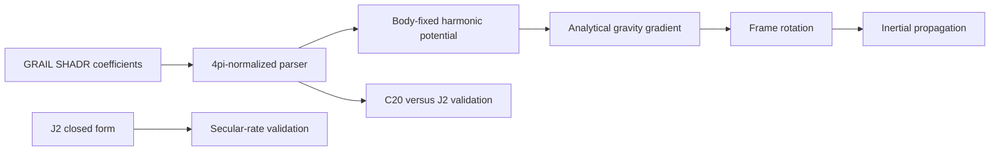

# Lunar Astrodynamics Simulation


[](https://github.com/sylvesterkaczmarek/lunar-astrodynamics-simulation/actions/workflows/ci.yml)


Validated Python simulation of lunar orbital dynamics from central gravity and J2 through high-degree GRAIL spherical harmonics. The code reads NASA PDS SHADR gravity products, evaluates fully normalized `Cnm/Snm` fields in the lunar body-fixed frame, and supports explicit rotation back to an inertial propagation frame.

## At a glance


```mermaid
flowchart LR
    A[GRAIL SHADR coefficients] --> B[4pi-normalized parser]
    B --> C[Body-fixed harmonic potential]
    C --> D[Analytical gravity gradient]
    D --> E[Frame rotation]
    E --> F[Inertial propagation]
    G[J2 closed form] --> H[Secular-rate validation]
    B --> I[C20 versus J2 validation]
```

The repository deliberately keeps the low-degree J2 benchmark because it provides an independent analytical check on the numerical machinery. The spherical-harmonic layer then adds longitude-dependent tesseral and sectoral gravity terms, including the high-degree gravity signatures associated with lunar mascons.

## Implemented models

- central lunar gravity
- closed-form J2 perturbation
- geodesy 4π-normalized spherical harmonics
- arbitrary `Cnm/Snm` degree and order truncation
- NASA PDS SHADR parsing
- GRGM1200A metadata and download tooling
- body-fixed harmonic acceleration
- body-fixed to inertial force transformation
- optional SPICE frame transformations
- terminal mean-radius surface event

The evaluator is stress-tested through degree 1200. The 88 MB GRGM1200A coefficient table remains an external NASA data product and is not copied into this repository.

## Validation

The current automated suite contains 24 tests. It includes two independent checks that are particularly useful for the harmonic implementation:

| Check | Result |
|---|---:|
| Normalized `C20` acceleration versus closed-form J2 | `1.78e-16` relative difference |
| Tesseral analytical acceleration versus finite-difference potential gradient | `9.86e-10` relative difference |

The original 40-orbit J2 regression remains unchanged:

| Quantity | Analytical | Numerical | Relative difference |
|---|---:|---:|---:|
| RAAN rate | -0.773273 deg/day | -0.773527 deg/day | 0.033% |
| Periapsis-argument rate | 0.820180 deg/day | 0.817987 deg/day | 0.267% |

See [`results/j2_validation.json`](results/j2_validation.json) and [`results/harmonic_validation.json`](results/harmonic_validation.json).

## Quick start

```bash
git clone https://github.com/sylvesterkaczmarek/lunar-astrodynamics-simulation.git
cd lunar-astrodynamics-simulation
python -m venv .venv
source .venv/bin/activate
python -m pip install -e .[dev]
python -m pytest
python examples/j2_precession.py --orbits 40
python examples/harmonic_validation.py
```

Windows PowerShell users can activate the environment with `.venv\Scripts\Activate.ps1`.

## Use GRGM1200A

Download the official NASA PDS product:

```bash
python scripts/download_grgm1200a.py
```

Then evaluate the full degree/order 1200 field at a body-fixed point:

```bash
python examples/grgm1200a_gravity.py \
  --model data/gggrx_1200a_sha.tab \
  --degree 1200 \
  --position-km 1900 200 300
```

The archived GRGM1200A metadata used by the code are GM `4902.80011526323 km^3/s^2`, reference radius `1738.0 km`, geodesy 4π normalization, and a DE430-defined lunar principal-axes body-fixed frame.

## Inertial propagation

High-degree lunar gravity must not be frozen in an inertial frame. Supply an explicit body-fixed-from-inertial rotation:

```python
from lunar_astrodynamics import (
    gravity_acceleration_inertial,
    propagate_with_acceleration,
    spice_rotation_provider,
)

rotation = spice_rotation_provider(
    "J2000",
    "YOUR_LOADED_LUNAR_PA_FRAME",
    et_offset_s=et0,
)

acceleration = lambda t, r: gravity_acceleration_inertial(
    t,
    r,
    model,
    rotation,
    max_degree=1200,
)

solution = propagate_with_acceleration(
    initial_state,
    duration_s,
    acceleration,
    collision_radius_m=1_737_400.0,
)
```

The frame name is intentionally not hard-coded. It must correspond to the SPICE kernel set loaded by the user.

## Mascons

The implementation does not approximate mascons as separate point masses. Their gravity signatures are represented by the high-degree GRAIL spherical-harmonic coefficients. This is why `mascons` and `spherical-harmonics` are accurate repository topics once an actual GRAIL coefficient set is used.

## Repository layout

```text
lunar-astrodynamics-simulation/
├── .github/workflows/ci.yml
├── assets/
│   ├── results/j2_precession.svg
│   └── social/github-social-card-lunar-astrodynamics.png
├── docs/
│   ├── model.md
│   └── reproducibility.md
├── examples/
│   ├── grgm1200a_gravity.py
│   ├── harmonic_validation.py
│   └── j2_precession.py
├── scripts/download_grgm1200a.py
├── src/lunar_astrodynamics/
│   ├── analysis.py
│   ├── constants.py
│   ├── dynamics.py
│   ├── elements.py
│   ├── frames.py
│   ├── harmonics.py
│   └── propagation.py
├── tests/
├── CITATION.cff
├── LICENSE
├── Makefile
├── pyproject.toml
└── README.md
```

## What this repository does not claim

This remains a research and validation implementation, not certified flight-dynamics software. The repository does not bundle NASA's coefficient file, lunar topography, automatic SPICE kernels, third-body gravity, solar radiation pressure, covariance propagation, or orbit-determination estimation.

See [docs/model.md](docs/model.md) for the force model and [docs/reproducibility.md](docs/reproducibility.md) for exact checks.

## Cite this repository

If you use or adapt this repository, please cite:

> Kaczmarek, S. (2026). *Lunar Astrodynamics Simulation*. GitHub. https://github.com/sylvesterkaczmarek/lunar-astrodynamics-simulation

```bibtex
@software{Kaczmarek_2026_Lunar_Astrodynamics_Simulation,
  author = {Sylvester Kaczmarek},
  title  = {Lunar Astrodynamics Simulation},
  year   = {2026},
  url    = {https://github.com/sylvesterkaczmarek/lunar-astrodynamics-simulation}
}
```

## License

MIT. See [LICENSE](LICENSE).

© **Sylvester Kaczmarek** · [https://www.sylvesterkaczmarek.com](https://www.sylvesterkaczmarek.com)
