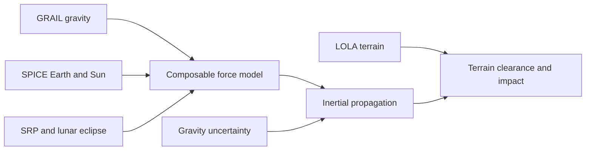

# Lunar Astrodynamics Simulation


[](https://github.com/sylvesterkaczmarek/lunar-astrodynamics-simulation/actions/workflows/ci.yml)


Validated Python lunar-orbit simulation and preliminary mission-analysis tooling from central gravity and J2 through high-degree GRAIL spherical harmonics, gravity-field uncertainty ensembles, LOLA terrain clearance, ephemeris-driven Earth/Sun perturbations, and optional solar radiation pressure with lunar eclipse handling.

The code keeps gravity, terrain, ephemerides, frames, uncertainty and perturbation forces explicit. Large NASA/NAIF datasets remain external and simulation provenance is exposed rather than hidden behind automatic model choices.

## At a glance


```mermaid
flowchart LR
    G[GRAIL gravity] --> F[Composable force model]
    E[SPICE Earth and Sun] --> F
    S[SRP and lunar eclipse] --> F
    F --> P[Inertial propagation]
    U[Gravity uncertainty] --> P
    L[LOLA terrain] --> C[Terrain clearance and impact]
    P --> C
```

## Implemented capabilities

- central lunar gravity and closed-form J2 perturbation
- geodesy 4pi-normalized spherical harmonics with arbitrary degree/order truncation
- NASA PDS SHADR parsing with retained coefficient and GM uncertainty fields
- pole-safe high-degree GRAIL gravity evaluation through degree/order 1200
- explicit body-fixed to inertial transformations and optional SPICE support
- covariance-derived GRGM1200A clone perturbation ensembles
- reproducible diagonal coefficient-sigma sensitivity sampling with explicit opt-in
- orbit uncertainty percentiles for altitude, osculating apsides, eccentricity, lifetime and impact
- NASA Goddard LOLA `MOON_PA_DE421` and standard LOLA PDS global terrain loading
- terrain-aware clearance, minimum-clearance geometry and impact events
- explicitly named mean-radius spherical collision fallback
- composable named force components with per-component acceleration diagnostics
- Moon-centred differential Earth and Sun third-body gravity
- deterministic SPICE epoch handling with kernel/frame/epoch provenance
- optional cannonball solar-radiation pressure using configurable mass, area and reflectivity coefficient
- finite apparent Sun/Moon disk eclipse model with full sunlight, umbra, annular and partial-shadow behavior
- external gravity, terrain and SPICE download/validation tooling

## Validation

The automated suite contains **107 tests** and passes on Python 3.10, 3.12 and 3.13.

Gravity validation includes normalized `C20` versus an independent J2 implementation, Cartesian finite-difference gradients, zonal/tesseral/sectoral fields, equatorial and polar cases, pole-crossing continuity, degree/order truncation, degree-1200 finiteness, and body-fixed/inertial consistency.

Uncertainty validation covers SHADR uncertainty retention, seeded reproducibility, explicit independent-sampling opt-in, covariance-derived clone perturbation semantics, percentile calculations and end-to-end gravity ensembles.

Terrain validation covers analytic interpolation fixtures, longitude wrapping, antimeridian continuity, poles, explicit frame mismatch rejection, terrain-impact roots, GMT/netCDF loading, PDS3 decoding, real LOLA reference values and an end-to-end terrain-impact example.

Force validation covers exact differential third-body geometries, the distant-body inverse-cube limit, SPICE epoch and kernel provenance, one-AU SRP magnitude, inverse-square SRP scaling, full sunlight, total lunar umbra, annular eclipse, partial eclipse and continuous shadow transitions.

Retained gravity checks are:

| Check | Result |
|---|---:|
| Normalized `C20` acceleration versus closed-form J2 | `1.83e-16` relative difference |
| Tesseral analytical acceleration versus finite-difference potential gradient | `9.86e-10` relative difference |

Scientific documentation:

- [`docs/model.md`](docs/model.md)
- [`docs/uncertainty.md`](docs/uncertainty.md)
- [`docs/terrain.md`](docs/terrain.md)
- [`docs/forces.md`](docs/forces.md)
- [`docs/reproducibility.md`](docs/reproducibility.md)

## Quick start

```bash
git clone https://github.com/sylvesterkaczmarek/lunar-astrodynamics-simulation.git
cd lunar-astrodynamics-simulation
python -m venv .venv
source .venv/bin/activate
python -m pip install -e .[dev]
python -m pytest
python examples/j2_precession.py --orbits 40
python examples/harmonic_validation.py
python examples/gravity_uncertainty.py --samples 16 --seed 20260817 --duration-days 1
python examples/terrain_clearance.py
```

Windows PowerShell users can activate the environment with `.venv\Scripts\Activate.ps1`.

## High-degree GRAIL gravity

Download the official NASA PDS GRGM1200A product:

```bash
python scripts/download_grgm1200a.py
```

Evaluate the full degree/order 1200 field at a body-fixed point:

```bash
python examples/grgm1200a_gravity.py \
  --model data/gggrx_1200a_sha.tab \
  --degree 1200 \
  --position-km 1900 200 300
```

The archived GRGM1200A metadata used by the code are GM `4902.80011526323 km^3/s^2`, reference radius `1738.0 km`, geodesy 4pi normalization, and a DE430-defined lunar principal-axes body-fixed frame.

## Gravity-field uncertainty

`read_shadr(...)` retains the uncertainty fields distributed with SHADR products. These individual sigmas do not contain the full coefficient covariance, so independent sampling requires explicit acknowledgement:

```python
realizations = sample_independent_coefficient_uncertainty(
    model,
    seed=1234,
    count=100,
    assume_independent=True,
)
```

For correlated GRGM1200A uncertainty, use the covariance-derived clone perturbations archived by NASA PDS:

```bash
python scripts/download_grgm1200a_clones.py 1 2 3 4 5
```

Clone coefficients are deviations from the nominal field and are applied to a compatible nominal model before propagation. See [`docs/uncertainty.md`](docs/uncertainty.md).

## LOLA terrain clearance

For gravity/topography work, the recommended global source is NASA Goddard's 2024 LOLA MOON_PA grid. The 64 pixels/degree product uses a `1737.4 km` reference radius and the `MOON_PA_DE421` principal-axes frame.

```bash
python scripts/download_lola_pa_shape.py --registration gridline
python -m pip install -e .[terrain]
python scripts/prepare_lola_pa_grid.py \
  data/LDEM64_PA_gridline_202405.grd \
  --stride 8 \
  --output data/lola_moon_pa_8ppd.npz
```

The production loader has been validated against the actual 736,545,335-byte NASA Goddard grid. Terrain and gravity frames remain separate because the recommended terrain product is DE421 while GRGM1200A is a DE430 solution.

Terrain-aware propagation reports minimum clearance, its time and body-fixed location, local terrain elevation, and impact time/location/elevation when an impact occurs. The spherical fallback remains available as `make_mean_radius_surface_event(...)`.

See [`docs/terrain.md`](docs/terrain.md) and [`docs/lola_pa_validation.md`](docs/lola_pa_validation.md).

## Earth, Sun and solar radiation pressure

Install SPICE support and download the small generic kernel set used by the reproducible comparison example:

```bash
python -m pip install -e .[spice]
python scripts/download_force_model_kernels.py
```

This obtains `naif0012.tls`, `de440s.bsp` and `pck00011.tpc` from NAIF. The repository does not commit the kernels.

Run the four-level force comparison:

```bash
python examples/force_model_comparison.py \
  --kernel-dir data/spice \
  --epoch-utc 2026-08-17T00:00:00 \
  --duration-days 7 \
  --samples 1001
```

The example compares:

1. lunar central + J2 gravity;
2. lunar gravity + differential Earth third-body gravity;
3. lunar gravity + Earth + Sun third-body gravity;
4. lunar gravity + Earth + Sun + SRP with finite-disk lunar eclipse attenuation.

The J2 term is evaluated in SPICE `IAU_MOON` and rotated into J2000. Earth and Sun positions are geometric Moon-centred SPICE positions using `abcorr=NONE`. The output records UTC and ET epoch, inertial/body frames, loaded kernels, spacecraft SRP parameters and force-component provenance.

A live two-day validation on 17 August 2026 produced the following final separations from the lunar-gravity-only solution for the documented test orbit:

| Added forces | Final position difference | Final velocity difference |
|---|---:|---:|
| Earth | `2235.102 m` | `1.918611 m/s` |
| Earth + Sun | `2242.958 m` | `1.923915 m/s` |
| Earth + Sun + SRP | `2222.287 m` | `1.916217 m/s` |

The SRP case encountered both full lunar umbra and partial penumbra. These values are specific to the documented epoch, orbit and spacecraft parameters and are not universal perturbation magnitudes. The full record is [`results/force_model_spice_validation.json`](results/force_model_spice_validation.json).

See [`docs/forces.md`](docs/forces.md).

## Frame compatibility

Frame identity is part of the model. The code does not silently equate `MOON_PA_DE421`, a DE430-compatible GRAIL principal-axes frame, `IAU_MOON`, or any other lunar frame.

A combined run should construct the gravity and terrain transformations required by those products separately. Ephemeris-driven perturbations likewise record their inertial frame and SPICE kernel context.

## High-degree timing

```bash
python scripts/benchmark_harmonics.py --degree 1200 --repetitions 5
```

## Repository layout

```text
lunar-astrodynamics-simulation/
├── .github/workflows/ci.yml
├── docs/
│   ├── forces.md
│   ├── lola_pa_validation.md
│   ├── model.md
│   ├── reproducibility.md
│   ├── terrain.md
│   └── uncertainty.md
├── examples/
│   ├── force_model_comparison.py
│   ├── gravity_uncertainty.py
│   ├── grgm1200a_gravity.py
│   ├── harmonic_validation.py
│   ├── j2_precession.py
│   └── terrain_clearance.py
├── results/
│   ├── force_model_spice_validation.json
│   └── lola_pa_validation.json
├── scripts/
│   ├── benchmark_harmonics.py
│   ├── download_force_model_kernels.py
│   ├── download_grgm1200a.py
│   ├── download_grgm1200a_clones.py
│   ├── download_lola_pa_shape.py
│   ├── prepare_lola_pa_grid.py
│   ├── validate_lola_pa_reference.py
│   └── validate_lola_pds_reference.py
├── src/lunar_astrodynamics/
│   ├── analysis.py
│   ├── constants.py
│   ├── dynamics.py
│   ├── elements.py
│   ├── ephemeris.py
│   ├── forces.py
│   ├── frames.py
│   ├── harmonics.py
│   ├── propagation.py
│   ├── terrain.py
│   └── uncertainty.py
└── tests/
```

## What this repository does not claim

This is research and validation software, not certified flight-dynamics software.

High-fidelity lunar runs still require appropriate high-degree gravity, compatible lunar orientation/frame kernels, terrain resolution, gravity uncertainty treatment and a force model selected for the required prediction horizon. Earth and Sun are point-mass third bodies here. The current model does not include lunar tides/time-variable gravity, Earth oblateness as an extended perturber, relativity, other planetary third bodies, Earth radiation pressure, lunar albedo/thermal radiation, maneuvers, thrust, mass depletion or navigation-estimation error.

SRP is a configurable cannonball model. It does not model spacecraft attitude, separate optical surfaces, articulation, self-shadowing or thermal reradiation. Lunar eclipse uses a spherical Moon and finite apparent solar disk; LOLA limb topography and solar limb darkening are excluded.

The package does not construct the complete GRGM1200A covariance matrix internally. Terrain uncertainty, state covariance propagation and orbit determination are also not yet included.

The repository does not bundle NASA gravity/terrain products or NAIF kernels. Kernel coverage, kernel provenance, frame selection, epoch and integration settings remain caller-controlled parts of the numerical model.

## Cite this repository

If you use or adapt this repository, please cite:

> Kaczmarek, S. (2026). *Lunar Astrodynamics Simulation*. GitHub. https://github.com/sylvesterkaczmarek/lunar-astrodynamics-simulation

```bibtex
@software{Kaczmarek_2026_Lunar_Astrodynamics_Simulation,
  author = {Sylvester Kaczmarek},
  title  = {Lunar Astrodynamics Simulation},
  year   = {2026},
  url    = {https://github.com/sylvesterkaczmarek/lunar-astrodynamics-simulation}
}
```

## License

MIT. See [LICENSE](LICENSE).

© **Sylvester Kaczmarek** · [https://www.sylvesterkaczmarek.com](https://www.sylvesterkaczmarek.com)
