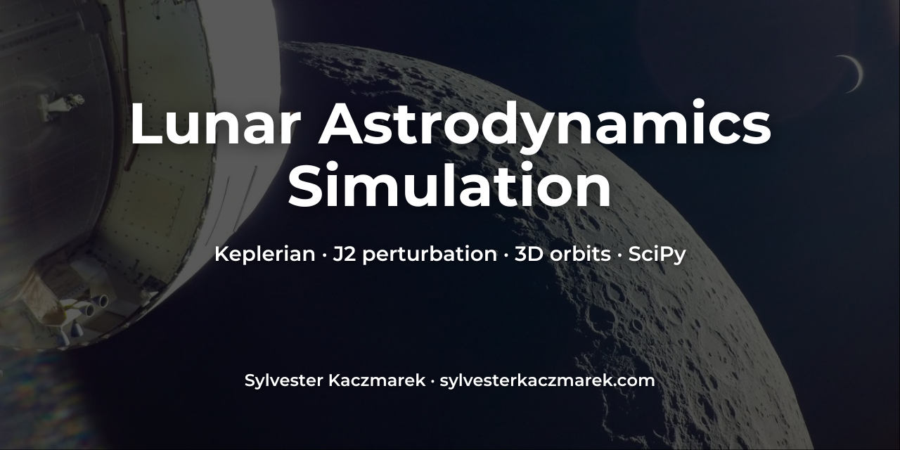
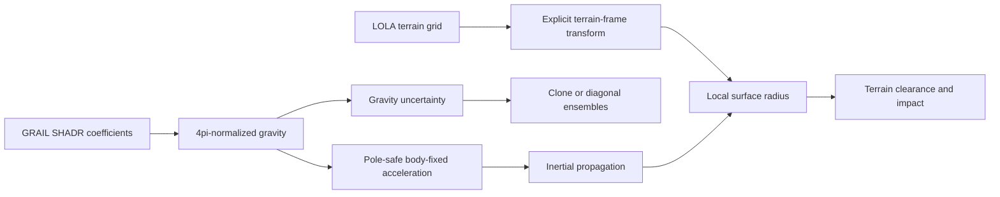

# Lunar Astrodynamics Simulation



[](https://github.com/sylvesterkaczmarek/lunar-astrodynamics-simulation/actions/workflows/ci.yml)


Validated Python simulation of lunar orbital dynamics from central gravity and J2 through high-degree GRAIL spherical harmonics, gravity-field uncertainty ensembles, and terrain-aware low-lunar-orbit clearance. The code reads NASA PDS gravity products, supports external LOLA shape grids, keeps lunar frame realizations explicit, and reports local terrain clearance and impact geometry instead of relying only on a mean-radius sphere.

## At a glance


```mermaid
flowchart LR
    A[GRAIL SHADR coefficients] --> B[4pi-normalized gravity]
    B --> C[Pole-safe body-fixed acceleration]
    C --> D[Inertial propagation]
    B --> U[Gravity uncertainty]
    U --> V[Clone or diagonal ensembles]
    L[LOLA terrain grid] --> T[Explicit terrain-frame transform]
    T --> Q[Local surface radius]
    D --> Q
    Q --> R[Terrain clearance and impact]
```

The low-degree J2 benchmark provides an independent analytical check. The high-degree layer adds longitude-dependent tesseral and sectoral gravity, including the signatures associated with lunar mascons. Gravity uncertainty and terrain geometry are separate model components with explicit provenance rather than hidden assumptions.

## Implemented capabilities

- central lunar gravity and closed-form J2 perturbation
- geodesy 4pi-normalized spherical harmonics with arbitrary degree/order truncation
- NASA PDS SHADR parsing with retained coefficient and GM uncertainty fields
- pole-safe high-degree gravity evaluation through degree/order 1200
- explicit body-fixed to inertial transformations and optional SPICE support
- covariance-derived GRGM1200A clone perturbation ensembles
- reproducible diagonal coefficient-sigma sensitivity sampling
- orbit uncertainty percentiles for altitude, osculating apsides, eccentricity, lifetime and impact
- global regular latitude/longitude terrain model abstraction
- NASA Goddard 2024 LOLA `MOON_PA_DE421` GMT/netCDF grid loading
- standard global LOLA PDS3 cylindrical IMG/label loading
- periodic longitude and antimeridian-safe terrain interpolation
- explicit exact-pole handling for gridline and pixel registration
- terrain-aware clearance, minimum-clearance location and impact geometry
- explicitly named mean-radius spherical collision fallback
- external data download and preparation tooling

The large GRGM1200A and LOLA source datasets remain external NASA products and are not copied into this repository.

## Validation

The current automated suite contains **88 tests** and passes on Python 3.10, 3.12 and 3.13.

Gravity validation includes normalized `C20` versus an independent J2 implementation, Cartesian finite-difference gradients, zonal/tesseral/sectoral fields, equatorial and polar cases, pole-crossing continuity, degree/order truncation, degree-1200 finiteness, and body-fixed/inertial consistency.

Uncertainty validation covers SHADR uncertainty retention, seeded reproducibility, explicit independent-sampling opt-in, covariance-derived clone perturbation semantics, percentile calculations and end-to-end gravity ensembles.

Terrain validation covers analytic interpolation fixtures, longitude wrapping, `0/360` continuity, the `+/-180 degree` boundary, exact poles, pixel polar caps, explicit frame mismatch rejection, terrain-impact roots and geometry, GMT/netCDF loading, PDS3 decoding, selected official LOLA reference elevations, prepared-grid metadata round trips and an end-to-end terrain-impact example.

Retained gravity checks are:

| Check | Result |
|---|---:|
| Normalized `C20` acceleration versus closed-form J2 | `1.83e-16` relative difference |
| Tesseral analytical acceleration versus finite-difference potential gradient | `9.86e-10` relative difference |

See [`docs/model.md`](docs/model.md), [`docs/uncertainty.md`](docs/uncertainty.md), [`docs/terrain.md`](docs/terrain.md), and [`docs/reproducibility.md`](docs/reproducibility.md).

## Quick start

```bash
git clone https://github.com/sylvesterkaczmarek/lunar-astrodynamics-simulation.git
cd lunar-astrodynamics-simulation
python -m venv .venv
source .venv/bin/activate
python -m pip install -e .[dev]
python -m pytest
python examples/j2_precession.py --orbits 40
python examples/harmonic_validation.py
python examples/gravity_uncertainty.py --samples 16 --seed 20260817 --duration-days 1
python examples/terrain_clearance.py
```

Windows PowerShell users can activate the environment with `.venv\Scripts\Activate.ps1`.

## Use GRGM1200A

Download the official NASA PDS nominal product:

```bash
python scripts/download_grgm1200a.py
```

Evaluate the full degree/order 1200 field at a body-fixed point:

```bash
python examples/grgm1200a_gravity.py \
  --model data/gggrx_1200a_sha.tab \
  --degree 1200 \
  --position-km 1900 200 300
```

The archived GRGM1200A metadata used by the code are GM `4902.80011526323 km^3/s^2`, reference radius `1738.0 km`, geodesy 4pi normalization, and a DE430-defined lunar principal-axes body-fixed frame.

## Gravity-field uncertainty

`read_shadr(...)` retains the coefficient uncertainty fields distributed with a SHADR gravity product. These values do not contain the full off-diagonal covariance, so independent coefficient sampling requires explicit acknowledgement:

```python
realizations = sample_independent_coefficient_uncertainty(
    model,
    seed=1234,
    count=100,
    assume_independent=True,
)
```

For correlated GRGM1200A gravity uncertainty, use covariance-derived clone perturbations archived by NASA PDS:

```bash
python scripts/download_grgm1200a_clones.py 1 2 3 4 5
```

Clone coefficients are deviations from the nominal field. The library applies each perturbation to a compatible nominal GRGM1200A model before propagation. See [`docs/uncertainty.md`](docs/uncertainty.md).

## LOLA terrain data

For gravity/topography work, the recommended global source is NASA Goddard's 2024 **LOLA MOON_PA gridded dataset**. The 64 pixels/degree global grid has a reference radius of `1737.4 km` and is explicitly in the `MOON_PA_DE421` principal-axes frame.

Download the gridline product:

```bash
python scripts/download_lola_pa_shape.py --registration gridline
```

Install optional netCDF support and prepare a smaller working grid if desired:

```bash
python -m pip install -e .[terrain]
python scripts/prepare_lola_pa_grid.py \
  data/LDEM64_PA_gridline_202405.grd \
  --stride 8 \
  --output data/lola_moon_pa_8ppd.npz
```

Native 64 pixels/degree is about `0.5 km` spacing at the lunar equator. Downsampling is useful for preliminary studies but directly reduces terrain fidelity.

## Frame compatibility

The recommended terrain product is `MOON_PA_DE421`, while GRGM1200A is a DE430 gravity solution. The code does not silently identify these frames.

A combined science run should construct separate SPICE rotations:

```python
terrain_rotation = spice_rotation_provider(
    "J2000",
    "MOON_PA_DE421",
    et_offset_s=et0,
)

gravity_rotation = spice_rotation_provider(
    "J2000",
    "YOUR_DE430_COMPATIBLE_LUNAR_PA_FRAME",
    et_offset_s=et0,
)
```

The exact frame names must exist in the caller's loaded kernel set. The terrain API also requires `terrain_frame` to match `terrain.frame`, so an accidental mismatch fails rather than producing a plausible but displaced surface.

## Terrain-aware propagation

```python
result = propagate_with_terrain(
    initial_state,
    duration_s,
    acceleration,
    terrain,
    terrain_rotation,
    terrain_frame=terrain.frame,
)

report = result.clearance
print(report.minimum_clearance_m)
print(report.minimum_location.latitude_deg)
print(report.minimum_location.longitude_deg_east)
print(report.impacted)
```

The report includes minimum clearance, its time and body-fixed location, terrain elevation at closest approach, and impact time/location/elevation when an impact occurs.

The spherical fallback is still available explicitly:

```python
make_mean_radius_surface_event(1_737_400.0)
```

`make_surface_event(...)` remains as a backward-compatible alias.

## Why terrain changes the result

The CI terrain example uses a circular orbit about `4.0 km` above the reference sphere and a synthetic 6 km mountain. The spherical model reports no impact. The terrain-aware model impacts the interpolated surface at about `1319.7 s`, near `72.86 degrees east`, where local terrain reaches approximately `4.0 km` above the reference sphere.

Run it with:

```bash
python examples/terrain_clearance.py
```

A prepared LOLA grid can also be supplied. That demonstration uses a simple constant-rate orientation; science runs should use SPICE for the exact terrain frame and epoch.

## Official LOLA PDS reader check

A live validation utility downloads the official `LDEM_4` global PDS product and reports selected grid values:

```bash
python scripts/validate_lola_pds_reference.py
```

On 17 August 2026 the reader obtained, among others, `-796.0 m` at `0.125 N, 0.125 E`, `-3814.5 m` at `0.125 N, 90.125 E`, and `2432.0 m` at `0.125 N, 180.125 E`. These values are frozen into offline regression tests so routine CI does not depend on network access.

The standard PDS grid identifies itself as the DE421 Mean Earth/Polar Axis frame. It validates the raw PDS reader and should not be silently substituted for the dedicated MOON_PA terrain grid.

## High-degree timing

```bash
python scripts/benchmark_harmonics.py --degree 1200 --repetitions 5
```

## Repository layout

```text
lunar-astrodynamics-simulation/
├── .github/workflows/ci.yml
├── docs/
│   ├── model.md
│   ├── reproducibility.md
│   ├── terrain.md
│   └── uncertainty.md
├── examples/
│   ├── gravity_uncertainty.py
│   ├── grgm1200a_gravity.py
│   ├── harmonic_validation.py
│   ├── j2_precession.py
│   └── terrain_clearance.py
├── scripts/
│   ├── benchmark_harmonics.py
│   ├── download_grgm1200a.py
│   ├── download_grgm1200a_clones.py
│   ├── download_lola_pa_shape.py
│   ├── prepare_lola_pa_grid.py
│   └── validate_lola_pds_reference.py
├── src/lunar_astrodynamics/
│   ├── analysis.py
│   ├── constants.py
│   ├── dynamics.py
│   ├── elements.py
│   ├── frames.py
│   ├── harmonics.py
│   ├── propagation.py
│   ├── terrain.py
│   └── uncertainty.py
└── tests/
```

## What this repository does not claim

This remains a research and validation implementation, not certified flight-dynamics software. The terrain surface is a radial gridded shape with bilinear interpolation, so it cannot represent relief below the selected grid resolution. It does not yet include terrain uncertainty, finite spacecraft geometry, or landing-footprint contact. High-resolution terminal descent and surface operations should use specialised local DEMs.

The package does not construct the complete GRGM1200A covariance matrix internally. Earth/Sun third-body gravity, solar radiation pressure, state covariance propagation and orbit determination are also not yet included.

The repository does not bundle NASA's large gravity, clone or LOLA datasets. SPICE kernels and frame/epoch selection remain caller-supplied parts of the numerical model.

## Cite this repository

If you use or adapt this repository, please cite:

> Kaczmarek, S. (2026). *Lunar Astrodynamics Simulation*. GitHub. https://github.com/sylvesterkaczmarek/lunar-astrodynamics-simulation

```bibtex
@software{Kaczmarek_2026_Lunar_Astrodynamics_Simulation,
  author = {Sylvester Kaczmarek},
  title  = {Lunar Astrodynamics Simulation},
  year   = {2026},
  url    = {https://github.com/sylvesterkaczmarek/lunar-astrodynamics-simulation}
}
```

## License

MIT. See [LICENSE](LICENSE).

© **Sylvester Kaczmarek** · [https://www.sylvesterkaczmarek.com](https://www.sylvesterkaczmarek.com)
